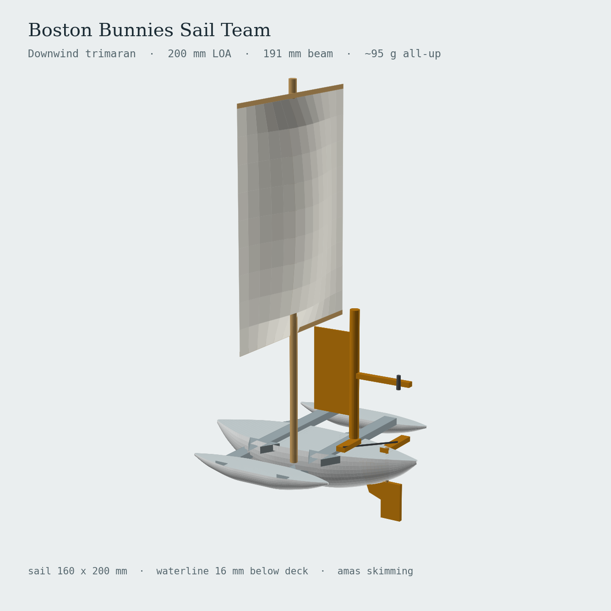

# Boston Bunnies Sail Team

Boat designs of the Boston Bunnies Sail Team.

Current design: a **self-steering downwind trimaran** — a 200 mm, ~95 g model yacht
that prints as one piece, carries a square sail on a dowel mast, and holds its
course with a mechanical wind vane driving the rudder. No electronics.

## Repository layout

| Path | What it is |
|---|---|
| [`cad/BostonBunnies_Trimaran.FCMacro`](cad/BostonBunnies_Trimaran.FCMacro) | Parametric FreeCAD macro — generates every printed part |
| [`docs/design-spec.md`](docs/design-spec.md) | Design spec and build guide: dimensions, weight budget, rigging, tuning, BOM |
| [`renders/`](renders/) | Reference renders of the assembled boat |

## Quick start

1. Open FreeCAD (0.20, 0.21 and 1.0 are tested) and go to **Macro → Macros… → Execute**,
   pointing at `cad/BostonBunnies_Trimaran.FCMacro`.
2. The macro builds five parts in a new document:
   `Trimaran_Body`, `Rudder_Blade`, `Rudder_Tiller`, `Vane_Paddle`, `Vane_Arm`.
3. Export them as STL. The macro has a commented-out export block at the bottom if
   you'd rather batch it.
4. Slice the body **deck-down** — flip 180° about X. Everything on deck is a recess,
   so it prints with no supports.
5. Build the sail and rig from the [spec sheet](docs/design-spec.md); mast, yards,
   bearings and pushrod are off-the-shelf parts.

To change the design, edit the `PARAMETERS` block at the top of the macro and re-run.
Hull stations, ama placement, mast position, skeg size and arm hole spacing are all
driven from there.

## Principal dimensions

| Item | Value |
|---|---|
| Length overall | 200 mm |
| Beam overall | 191 mm |
| All-up weight | ~95 g |
| Design waterline | 16 mm below deck, amas just skimming |
| Sail | 160 × 200 mm square, on mast + two yards |
| Print footprint | 200 × 191 × 42 mm — fits a 220 × 220 bed |

Full numbers, weight budget and bill of materials live in [`docs/design-spec.md`](docs/design-spec.md).

## How the steering works

A wind vane forward of the rudder is linked to the tiller by an adjustable pushrod.
Three details make or break it, and all three are easy to get wrong:

* **Arms on opposite sides.** Vane arm to port, tiller arm to starboard. The reversal
  is what makes a course error push the bow *back*. Same side and the boat spirals.
* **Balance the vane.** Slide the M3 screw along the counterweight slot until the
  paddle sits indifferent at any angle with the boat heeled 10–15°. An unbalanced
  vane steers to the low side, not to the wind.
* **Gain = vane hole radius ÷ tiller hole radius.** Start at 6/18 ≈ 0.33. Fishtailing
  means go smaller; lazy wandering means go larger.

The single centerline skeg supplies the damping — there are no fins on the amas.
Sail effort sits forward at 40 % LOA and lateral resistance sits aft, which is what
keeps the boat tracking downwind instead of sliding sideways.

Working range is roughly 2.5 m/s of steady breeze. Above that an ama buries and the
boat rounds up — an intentional fuse, not a failure.

## Design notes

The trimaran was chosen over a monohull, catamaran or proa because the amas carry no
load, so they need no precision to work. The amas are double-ended (transoms only pay
off above Froude ≈ 0.5, far beyond this scale) and finless. A cross-sail was rejected
for destabilizing the vane, and a keel for adding harmful lateral area downwind.
Upwind capability is deferred — it would need a cambered sail, a daggerboard forward,
and the CE/CLR order reversed.

Background and the reasoning behind these choices:
[design conversation](https://claude.ai/share/8d004267-fff6-457e-bb1f-0c273a21cccd)
(25 Aug 2026).
