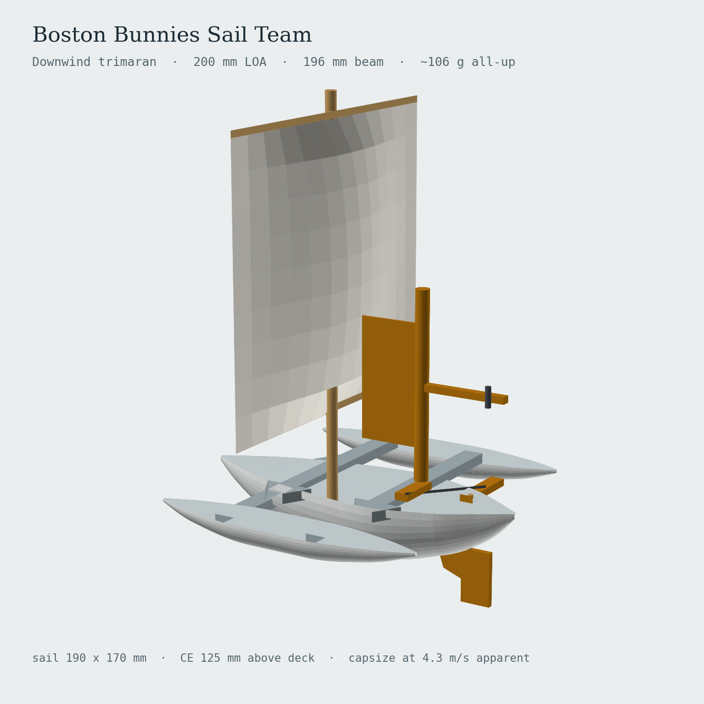

# Boston Bunnies Sail Team

Boat designs of the Boston Bunnies Sail Team — small, printable, self-steering sailing
models. Each boat is a parametric FreeCAD macro plus the spec and renders that go with
it.

## Fleet

| Boat | Current | What it is |
|---|---|---|
| [**Lahar**](boats/lahar/) | v1 | Self-steering downwind trimaran. 200 mm, ~106 g, square sail on a dowel mast, mechanical wind vane driving the rudder. No electronics. |

[](boats/lahar/)

## Repository layout

```
boats/<name>/
  README.md          the boat — current design up front, version history at the end
  cad/               parametric FreeCAD macro: the source of truth
  docs/              design spec and build guide
  renders/           reference renders of the current design
  versions/vN/       frozen superseded iterations, each with its own README
```

The current design always sits at the boat root, so `boats/lahar/cad/lahar.FCMacro` is
always the macro you want. Superseded iterations move down into `versions/` and stay
readable without competing for attention.

## Working on a design

The macro is the single source of truth. Everything else — the dimensions in the spec,
the figures printed on the renders — is a snapshot derived from it. To change a design,
edit the `PARAMETERS` block at the top of the macro and regenerate, rather than
hand-editing the derived numbers downstream. Numbers that get hand-patched in one place
and not another are how a spec and a render end up disagreeing about the same boat.

See [`boats/lahar/versions/README.md`](boats/lahar/versions/README.md) for how to cut a
new version once a design has been printed and sailed.
