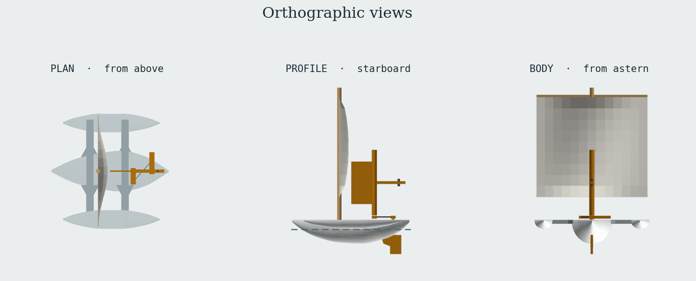
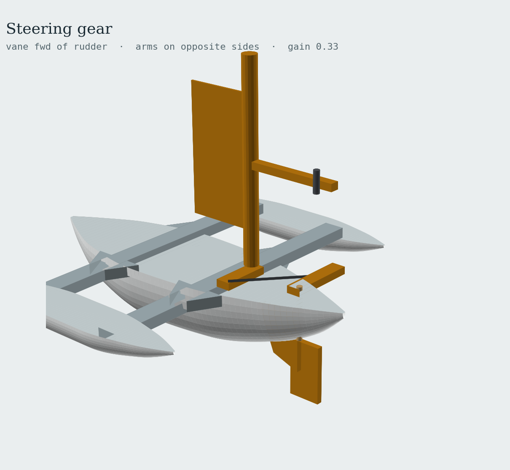

# Lahar

A **self-steering downwind trimaran** — a 200 mm, ~106 g model yacht that prints as one
piece, carries a square sail on a dowel mast, and holds its course with a mechanical
wind vane driving the rudder. No electronics.

**Current version: v1** (designed, not yet printed).

## Files

| Path | What it is |
|---|---|
| [`cad/lahar.FCMacro`](cad/lahar.FCMacro) | Parametric FreeCAD macro — generates every printed part |
| [`docs/design-spec.md`](docs/design-spec.md) | Design spec and build guide: dimensions, weight budget, rigging, tuning, BOM |
| [`renders/`](renders/) | Reference renders |
| [`versions/`](versions/) | Superseded iterations (empty — v1 is the first) |

## Quick start

1. Open FreeCAD (0.20, 0.21 and 1.0 are tested) and go to **Macro → Macros… → Execute**,
   pointing at `cad/lahar.FCMacro`.
2. The macro builds five parts in a document named `Lahar_v1`:
   `Trimaran_Body`, `Rudder_Blade`, `Rudder_Tiller`, `Vane_Paddle`, `Vane_Arm`.
3. Export them as STL. The macro has a commented-out export block at the bottom if
   you'd rather batch it.
4. Slice the body **deck-down** — flip 180° about X. Everything on deck is a recess,
   so it prints with no supports. Main hull at 4 % infill, amas at 0 % — they are
   floats, and the weight budget assumes it.
5. Build the sail and rig from the [spec sheet](docs/design-spec.md); mast, yards,
   bearings and pushrod are off-the-shelf parts.

To change the design, edit the `PARAMETERS` block at the top of the macro and re-run.
Hull stations, ama placement, mast position, skeg size and arm hole spacing are all
driven from there.

## Principal dimensions

| Item | Value |
|---|---|
| Length overall | 200 mm |
| Beam overall | 196 mm |
| All-up weight | ~106 g |
| Design waterline | ~16 mm below deck, amas clearing by 1.4 mm |
| Sail | 190 × 170 mm square, on mast + two yards |
| Print footprint | 200 × 196 × 46 mm — fits a 220 × 220 bed |

Full numbers, weight budget and bill of materials live in [`docs/design-spec.md`](docs/design-spec.md).

## How the steering works

*(Linkage geometry is current; the hull in this view predates the hull refinement.)*

A wind vane forward of the rudder is linked to the tiller by an adjustable pushrod.
Three details make or break it, and all three are easy to get wrong:

* **Arms on opposite sides.** Vane arm to port, tiller arm to starboard. The reversal
  is what makes a course error push the bow *back*. Same side and the boat spirals.
* **Balance the vane.** Slide the M3 screw along the counterweight slot until the
  paddle sits indifferent at any angle with the boat heeled 10–15°. An unbalanced
  vane steers to the low side, not to the wind.
* **Gain = vane hole radius ÷ tiller hole radius.** Start at 6/18 ≈ 0.33. Fishtailing
  means go smaller; lazy wandering means go larger.

The single centerline skeg supplies the damping — there are no fins on the amas.
Sail effort sits forward at 40 % LOA and lateral resistance sits aft, a 21 % LOA
separation, which is what keeps the boat tracking downwind instead of sliding sideways.

Below about 0.7 m/s of apparent wind the vane has too little torque to hold a course
and will wander. That is inherent to a vane this size, not a build fault.

## Stability, and why the rig is short and wide

The amas *are* the stability — the main hull alone has negative GM and will loll a
degree or two until one ama takes up. Normal trimaran behaviour.

Sail centre of effort sits 125 mm above deck. One fully buried ama gives 30 mN·m of
righting moment, which sets the capsize threshold at roughly 4.3 m/s apparent wind in
a 30° gust; comfortable sailing is up to ~3.3 m/s. Because apparent wind downwind is
true wind *minus* boat speed, the boat is most vulnerable at the moment you release
it, before it accelerates.

Two findings drove the current proportions:

* **Trading sail height for width is free stability.** An earlier 160 × 200 sail on
  a 330 mm mast put the CE at 190 mm and capsized at ~3.5 m/s. Same area at 190 × 170
  on a 250 mm mast raised the threshold to 4.3 m/s — 21 % more wind for free.
* **Lengthening the main hull does nothing for heel resistance.** BM_T = I_T/V and
  both scale with length, so stretching 200 → 280 mm leaves BM_T unchanged while
  adding 40 % wetted area. Heel resistance is a beam property. The amas were
  lengthened to 165 mm and their sections grown instead — +58 % righting moment
  inside the same footprint.

## Design notes

The trimaran was chosen over a monohull, catamaran or proa because the amas carry no
load, so they need no precision to work. The amas are double-ended (transoms only pay
off above Froude ≈ 0.5, far beyond this scale) and finless. A cross-sail was rejected
for destabilizing the vane, and a keel for adding harmful lateral area downwind.
Upwind capability is deferred — it would need a cambered sail, a daggerboard forward,
and the CE/CLR order reversed.

The design was settled by a full end-to-end audit — mass build-up, equilibrium
waterline, trim, stability, balance — which raised the weight budget from an optimistic
95 g to 106 g, widened the main hull and shifted its volume aft to cure a 5.7° stern
squat, re-proportioned the amas, and deepened the skeg and rudder to keep grip under
the deeper hull. The boat floats with a deliberate +2.3° stern-down trim, which
lightens the bow and helps it track.

Background and the reasoning behind these choices:
[design conversation](https://claude.ai/share/8d004267-fff6-457e-bb1f-0c273a21cccd)
(25 Aug 2026).

## Version history

| Version | Status | Notes |
|---|---|---|
| **v1** | current | Audited design: 196 mm beam, ~106 g, 190 × 170 sail, 165 mm amas. Not yet printed. |

An earlier pre-audit draft (191 mm beam, ~95 g, 160 × 200 sail on a 330 mm mast) was
superseded before anything was printed and is not carried as a version. It remains in
git history at commit `4af5a90` if you ever want to look at it; the stability section
above explains why its rig was cut down.

See [`versions/README.md`](versions/README.md) for how the next iteration gets cut.
