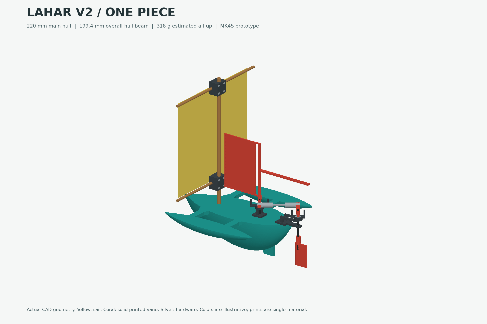

# Lahar v2

Downwind trimaran prototype for the **Prusa MK4S, stock 0.4 mm high-flow nozzle,
ordinary PLA, smooth PEI, no MMU**. Prepared 2026-09-15.

**One-piece revision:** the enclosed main hull, both amas, beams and skeg print
together, upside down, with a continuous rounded exterior. There are no separate
lids or ama joints. This replaces the earlier modular v2 draft.

**Rigging update:** the wind vane is now solid printed plastic, both yards have
four-bolt clamp sets, and both steering stands have matching recessed deck keys.
Use the updated body and steering jobs together. The clamps need **eight M2 x 16
socket-cap bolts and eight standard M2 hex nuts** in total, supplied separately.

**Software-validated, not physically printed or sailed.** Watertightness and
steering authority are acceptance tests, not promises from a CAD model.
Print the combined small-parts job first and use its coupon to check fit before
printing the body. The clevis's internal fork gap is still unknown.

## Start here

- [Printing instructions](instructions.md): two USB jobs, fit checks, and MK4S setup.
- [Design and assembly guide](docs/design-spec.md): sealing, linkage, weight budget, and test procedure.
- [Clamp and steering-mount details](renders/assembly-details.png): exploded assembly views.
- [Native FreeCAD assembly](cad/Lahar_v2.FCStd) and [STEP assembly](cad/Lahar_v2.step).
- [Parametric source macro](cad/lahar.FCMacro): edit parameters here to regenerate.
- [G-code](print/usb/), [self-contained 3MF projects](print/projects/), and [16 print-oriented STLs](print/stl/).

## What changed

The body restores v1's integrated, deck-down construction. Smooth half-ellipse
lofts form all three rounded hulls. The CAD has a measured **1.8 mm minimum
skin**, 0.9 mm ribs and 46 enclosed flotation cells. Hidden 45-degree roofs
close to a 0.6 mm gap, avoiding broad unsupported closures. Four perimeters
replace v1's two. The final body slice has no warnings or removable supports.
The rudder shaft stays outside the hull, eliminating that wet penetration.
Leak-testing is mandatory; a thin external seal coat may still be needed.

The quarter-chord rudder has **10.7 mm minimum clearance over its complete swept
envelope**. Both stocks use the existing 623ZZ bearings with short, loose lower
guides and inner-race spacers. The clevis tabs are **1.8 mm thick with 2.3 mm
holes**. A **64 x 96 mm solid vane with a 1.0 mm web** restores the printed blade,
with about 4.5 times v1's aerodynamic area-times-lever. Its extended counterweight
slot accommodates the extra weight. The existing 45 mm rod and clevises
form a nominal 64 mm pin-to-pin linkage; actual insertion depth needs checking.

Each yard has three printed clamp pieces and four bolts/nuts, holding the existing
6 mm mast and 4 mm yard without intersecting the rods. The steering stands fit
distinct asymmetric recesses with 1.8 mm of intact hull backing. Dry-fit them in
their keys, then bond the bases; the recesses are not snap fasteners or screw holes.

This is a conservative, heavier prototype: **220 x 199.4 x 65.2 mm body print,
about 318 g nominal all-up**, rather than v1's approximately 106 g target.
The forward hull sections have been filled out to carry the clamps and solid
vane. Minimum deck freeboard is calculated at 13.9 mm nominally and 12.4 mm at
a 350 g loading check. These are static estimates, not a certified payload or
wind rating. At 10 degrees of heel in the conservative-weight case, the low-side
deck is almost awash. Use sheltered water and verify the physical boat before sailing.

## Printer files

| Job | Time estimate | PLA including waste |
| --- | --- | --- |
| Steering, both clamp sets and fit coupon, 15 parts | 6 h 5 min | 58.03 g |
| One-piece body with locating recesses | 26 h 3 min | 238.82 g |

Total: **32 h 8 min and 296.85 g**, including the coupon and removable waste.
All 16 parts are included exactly once; only their placement and job grouping
changed. The body stays on its own bed. Have 350 g of PLA available.
Colors in the renders distinguish materials; all G-code jobs are single-material.

**The slicing is not identical to v1.** Deck-down printing and 0.15 mm layers are retained,
but the MK4S-specific printer preset, shell construction, perimeter count, solid
layers, and support layout are different. Never run the archived CORE One+ G-code
on the MK4S. The MK4S print volume is **250 x 210 x 220 mm**.

## More views and evidence

[One-piece body and print orientation](renders/one-piece-body.png) | [Hull section](renders/hull-section.png) |
[Steering](renders/steering-gear.png) | [Clamps and mount guides](renders/assembly-details.png) |
[Print layouts](renders/print-layouts.png)

The [CAD checks](reports/cad-validation.json), [slicing checks](reports/print-validation.json),
[engineering estimates](reports/engineering.json), and [render checks](reports/render-validation.json)
record what was verified. No physical hardware fit, seal, bearing friction, or
on-water steering test has been performed.

The untouched predecessor is in [versions/v1](../versions/v1/).