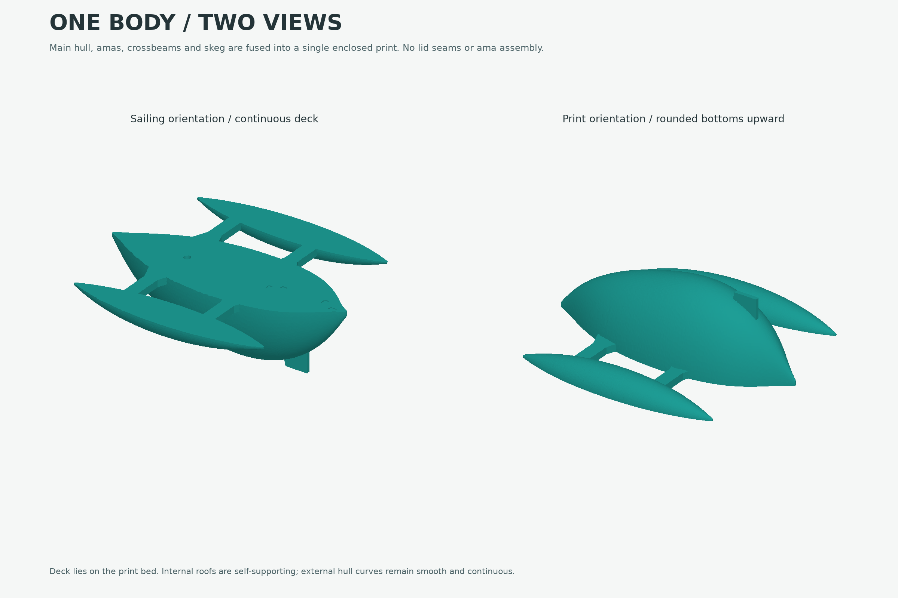
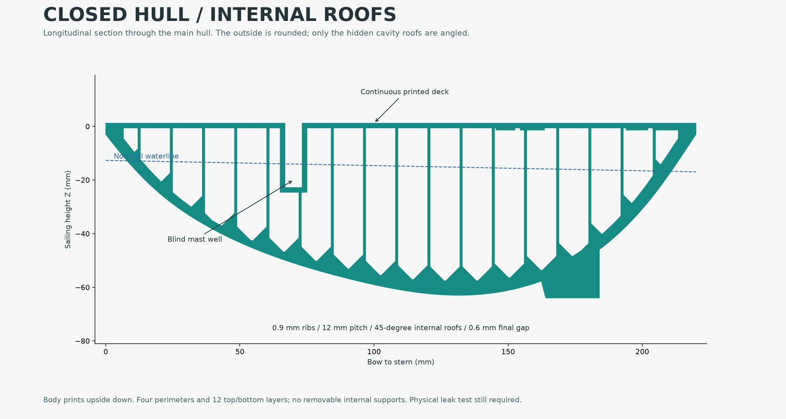
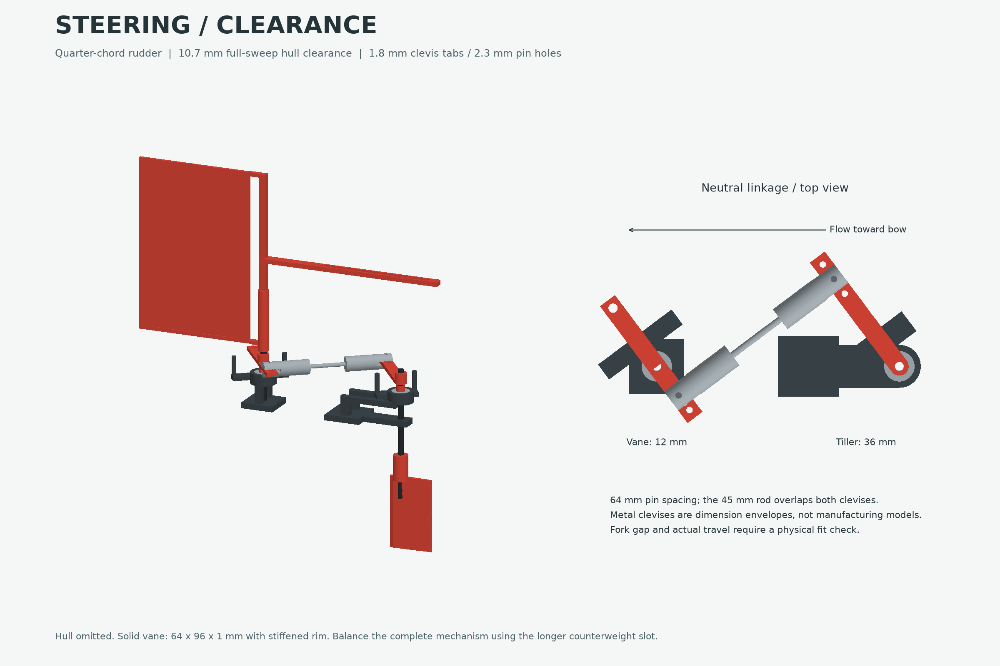
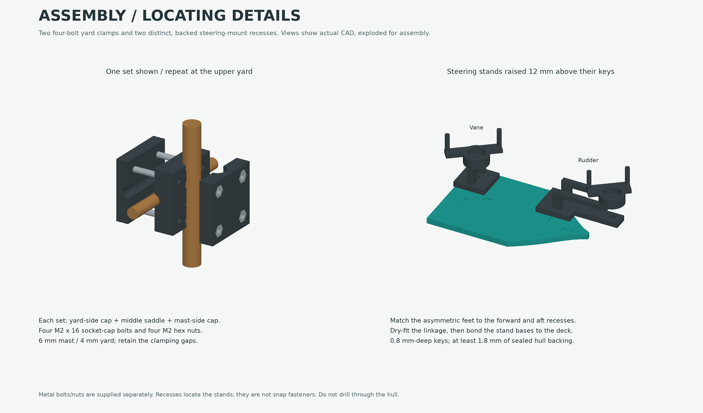

# Lahar v2: design and assembly

Boston Bunnies Sail Team, 2026-09-15. Source of truth:
[lahar.FCMacro](../cad/lahar.FCMacro). Generated estimates are in
[engineering.json](../reports/engineering.json).

**This is an untested physical prototype.** The design addresses v1's reported
leaks, rudder interference, clevis mismatch and steering-friction concerns.
No software check can certify an FDM hull as watertight or establish the friction
of the user's bearings. Complete the acceptance tests before open-water use.

## Design decisions

1. **Restore v1's one-piece, upside-down construction.** The main hull, both
   amas, two crossbeams, gussets and skeg form one enclosed solid. The continuous
   deck sits on the print bed; all three rounded bottoms grow upward. There are
   no separately printed lids, bonded ama joints or skeg attachment pad. This
   revision replaces the earlier modular v2 draft at the owner's request.
2. **Thicker skins and printable hidden closures.** Smooth half-ellipse lofts
   preserve the rounded exterior. Scaled internal cavities leave a CAD-measured
   minimum 1.8 mm skin, including the deck. Four perimeters replace v1's two.
   Internal 0.9 mm ribs at 12 mm spacing divide the hulls into 46 closed cells:
   18 in the main hull and 14 in each ama. Each cell has a 45-degree internal
   roof closing to a 0.6 mm gap. Only these hidden roofs are angled; the outside
   remains rounded. This avoids the floating bridge anchors encountered with
   simply hollowing the rounded body. Final slicing reports no warnings.
3. **No wet rudder penetration.** The rudder stock and its lower guide are on
   an external stern bracket. The mast well has a closed floor. Only the small
   steering stands bond onto the already closed deck. Distinct recessed keys
   locate them without screws into buoyancy chambers; those joints are not hull seals.
4. **Lower-load steering with the existing hardware.** Keep the two 623ZZ
   bearings and carbon stocks. Use short clearance guides, inner-race spacers,
   a quarter-chord rudder, thin clevis tabs and indexed cranks. The vane is now
   solid printed plastic again, with a 1 mm web and an extended counterweight slot.
   There is still plain-guide and clevis friction; the system is not frictionless.
5. **Four-bolt yard clamps.** Two three-piece clamp sets attach the existing
   6 mm mast to the two 4 mm yards. Each uses four M2 x 16 socket-cap bolts and
   four captive M2 nuts. The yards sit just forward of the mast so the rods
   do not intersect. Added plastic, hardware and counterweights are included
   in the revised mass calculation; the hull's forward sections are slightly fuller.



## Dimensions

Coordinates are millimetres: X runs bow to stern, Y is positive to starboard,
Z is upward. The continuous deck is Z=1.2, retained from the steering layout.

| Item | v2 |
| --- | --- |
| Main hull, measured mesh | 220 long x 79.46 maximum beam x 64.21 deep |
| One-piece body print bounds | 220 x 199.41 x 65.20 |
| Amas, measured mesh | 178 x 33.41 x 16.72; bows at X=22; centerlines Y=+/-83 |
| Main hull bottom | Continuously rounded; lowest mesh point Z=-63.01 |
| Minimum outer skin / continuous deck | At least 1.8 / 1.8 |
| Integral crossbeams | 12 x 180 x 6; leading edges X=60 and 132, flush with deck |
| Internal ribs / roofs | 0.9 thick, 12 pitch; 45-degree slopes, 0.6 final gap |
| Mast well | X=70; bore 6.4; insertion 24; closed floor 1.8 |
| Vane / rudder axes | X=154 / 234; Y=0 |
| Steering mount keys | Four blind recesses, 0.8 deep; matching feet 0.6 high; 1.8 minimum backing |
| Bearings | 623ZZ, 3 x 10 x 4; pockets 10.2 x 4.2 |
| Bearing top / linkage tab bottom | Z=19.8 / 24.2 |
| Lower guide bore | 3.8, short and accessible |
| Printed stock sockets | 3.2 |
| Rudder | 24 chord x 40 span; Z=-28 to -68; 25% chord pivot |
| Rudder cylindrical boss | 8 diameter, 14 high; Z=-30 to -16 |
| Full rudder sweep clearance | 10.71 minimum to the complete body and integral skeg |
| Integral skeg | X=150 to 184, 3 thick; tip Z=-64 |
| Solid printed vane | 64 x 96 area, 1.0 web, 1.2 rim; no film |
| Vane aerodynamic center lever | 40 from axis |
| Vane counterweight slot | 35 to 95 from axis |
| Vane / tiller gain holes | 12, 15, 18 / 30, 36, 42 |
| Clevis tabs / pivot holes | 1.8 thick / 2.3 diameter |
| Neutral pin-to-pin length | 64 with the 12/36 hole pair |
| Assembled length including centered rudder | 252 |
| Neutral length including longer counterweight arm | 256 |
| Yard centers | X=62.6; Z=40 and 210; 7.4 forward of mast |
| Yard clamps | Two sets of three 22 x 22 pieces; four M2 bolts/nuts per set |
| Clamp groove diameters / split gaps | 6.2 mast, 4.2 yard / 0.4 on each side of middle saddle |

The whole 220 x 199.41 mm body fits the **250 x 210 mm MK4S bed** with its brim.
Only the steering parts, clamp pieces and fit coupon print separately. The
rudder and longer counterweight arm extend beyond the printed body.
Loft interpolation makes measured dimensions differ slightly from station values.

## Weight and flotation

| Component group | Nominal mass |
| --- | --- |
| One body, eight steering parts and six clamp pieces, at PLA density 1.24 g/cm3 | 277.61 g |
| Mast, two yards, sail and rigging | 9.69 g |
| Carbon stocks | 1.52 g |
| Two 623ZZ bearings | 3.40 g |
| Metal clevises, screws and 45 mm rod | 6.00 g |
| Eight M2 x 16 clamp bolts and eight M2 nuts | 5.60 g |
| Fore-aft counterweight and lateral balance nuts allowance | 4.50 g |
| Adhesive and seal coat allowance | 10.00 g |
| **Nominal all-up** | **318.32 g** |

Hardware masses, wood density, cloth weight and seal-coat mass are assumptions,
not measurements. Cloth is budgeted at 30 g/m2. Weigh the actual parts.
The body alone is 239.77 g by CAD volume; both clamp sets together are 16.49 g.
The complete solid vane including its spine and counterweight arm is 10.33 g.
The two print jobs consume 296.85 g, including the coupon, supports and brims.
The coupon now shares the steering bed, but is never part of the boat's displacement.
Subtracting its 8.57 g CAD material estimate leaves 288.28 g; counting all the
remaining waste as if it stayed on the boat gives a conservative **328.99 g** case.
Repacking does not change the nominal assembled mass or center of gravity.

| Fresh-water case | Waterline at X=110 | Trim | Minimum deck freeboard | Lowest ama bottom |
| --- | --- | --- | --- | --- |
| Nominal 318.32 g | Z=-14.81 | 1.11 deg bow-down | 13.88 mm | 0.74 mm immersed |
| Conservative 328.99 g | Z=-13.96 | 0.96 deg bow-down | 13.32 mm | 1.59 mm immersed |
| 350 g loading check | Z=-12.41 | 0.65 deg bow-down | 12.36 mm | 3.12 mm immersed |

These are static calculations on closed exterior meshes generated from the CAD
with 0.04 mm deflection. Each mesh volume is checked against its CAD envelope.
Trimesh caps the submerged surface at the waterplane and SciPy solves displacement
and fore-aft balance. Required residuals are below 0.05 g and 0.05 mm; this is
solver tolerance, not a claim of equivalent physical accuracy. CAD boolean
integration was replaced because it produced noisy, non-converging derivatives.

The deeper main hull and fuller forward sections account for the new weight
and the mast clamps' forward location. This is heavier than both v1 and the earlier v2 drafts; no
speed or minimum-wind improvement is claimed from the hull change. Calculations
use the nominal CG and omit appendage buoyancy conservatively. Different hardware,
ballast, waves, wood water uptake and leaks change the answer. Do not reuse v1's
106 g budget or its claimed wind limit.

The planning-load model has restoring moments at both signs of 5 and 10 degrees
of heel. At 10 degrees in the conservative-weight case, the low-side deck has
only about **0.4 mm freeboard**, effectively awash in small ripples. Wave and
splash tolerance need physical testing. This is not a capsize angle or wind
rating. Use **350 g as a re-evaluation threshold**, not a certified carrying
capacity. Begin in sheltered, steady conditions with a retrieval line.



## Clevis and pushrod

Source: the user's [MECCANIXITY listing, ASIN B0D5L9FNG2](https://www.amazon.com/dp/B0D5L9FNG2),
accessed 2026-09-15, plus the dimension image supplied in the conversation.

| Interface | Evidence | v2 response |
| --- | --- | --- |
| 25 mm overall clevis length | Listing and dimension image | Include a full-length connector envelope |
| 8 mm outside width | Listing and image | Check 8 mm barrel clearance, not just the pivot pin |
| 2 mm rod-entry bore / M2 size | Image and title | Reuse the user's M2 rod; verify actual insertion and retention |
| M2 x 8 pivot screws | Listing package description | 2.3 mm clearance holes instead of v1's 1.6 mm holes |
| M3 grub screws | Listing and image | Retain the rod with the supplied hardware as appropriate |
| Internal fork gap | **Not dimensioned** | 1.8 mm tabs, tested first on a 1.5/1.8/2.1 mm coupon |
| Pivot-to-rear distance and usable rod insertion | **Not dimensioned** | Verify the assembled 64 mm pin spacing before bonding stands |

The product's M2 label does not define its fork gap. Its 8 mm width is outside
width, not an 8 mm slot. The marketplace's generic material field also conflicts
with its metal title and photo; it is not a manufacturing drawing.

The rod length is **45 mm, as reported by the user**, not 45 mm pin-to-pin.
For example, a 22 mm rear-to-pin distance on each clevis would require
12.5 mm insertion at each end to give 64 mm pin spacing:

$$L = 45 + a_1 + a_2 - e_1 - e_2.$$

Here $a$ is rear-to-pin distance and $e$ is insertion. That example is an
illustration, not a verified internal clevis dimension. Both retaining positions
must engage the rod securely. Do not force an unthreaded shank through a tapped
portion or leave the rod barely engaged to obtain the target length.
If your assembled link cannot reach 64 mm securely, stop and revise the axis
spacing with that measurement; do not force the linkage or bond misaligned stands.

The CAD collision check uses a conservative 8 mm diameter barrel extending
8-23 mm from the pin. The rendered clevis fork is schematic; its assumed opening
is not evidence of the real gap. Check the fork cheeks, screw heads and barrels
physically through the full travel.

## Steering and light wind



The vane is **solid printed plastic again**, with a 1.0 mm web matching v1's
blade thickness and a slightly thicker rim. It retains v2's larger 64 x 96 mm
area; its area times lever is **4.51 times v1's** under the same aerodynamic
coefficient. The object retains the name `Vane_Frame`, but no film is required.
It remains upstream of the sail while running downwind.

The larger solid paddle is not as light as the film version: its complete
printed mass is about 10.33 g. The 35-95 mm counterweight slot provides enough
reach for approximately 3 g of balancing hardware near 91 mm for the paddle
alone. This is a starting estimate, not a balance prescription for the complete
linkage. Rebalance with the stock, arm and metal clevis connected, including
the lateral imbalance. The mass budget allows another 1.5 g of lateral nuts.
More inertia and bearing load mean that increased area does not guarantee
good response in very light wind.

At neutral, the vane arm points **port and aft**; the tiller points **starboard
and forward**. Both are indexed 36.87 degrees from the transverse direction.
Do not straighten them to lie exactly across the boat. With the 12/36 mm holes,
their pin positions are (161.2, -9.6) and (212.4, 28.8), respectively. The rod
is perpendicular to the crank radii at neutral, maximizing mechanical leverage
and avoiding v1's short, oblique arrangement.

The exact four-bar calculation gives a neutral rudder/vane ratio of **-1/3**.
Vane travel from -40 to +40 degrees produces approximately +12.54 to -12.21
degrees of rudder rotation. The vane stops limit working travel; the rudder's
separate +/-25 degree stops are a backup when disconnected. Clearance was
checked every 2 degrees and against the rudder's entire cylindrical swept bound.
Only the default 12/36 configuration has this validation; changing holes needs
a new clearance check and calibration.

Your concern about downwind authority is justified. On a dead run,
$V_{app} \approx V_{true} - U_{boat}$, and vane torque falls with $V_{app}^2$.
The water-loaded rudder does not become load-free just because apparent wind
is small. Balancing and reducing friction help, but cannot remove that limit.

Illustrative estimates at a 10 degree vane error:

| Apparent wind | Vane torque |
| --- | --- |
| 0.5 m/s | 0.013 N mm |
| 0.75 m/s | 0.029 N mm |
| 1.0 m/s | 0.052 N mm |
| 1.5 m/s | 0.118 N mm |

These use air density 1.225 kg/m3 and an assumed normal-force coefficient
$C_N = 2\sin(\alpha)$. A 0.6 m/s boat-speed example, water lift slope 2.5/radian,
and 1-6 mm residual rudder hinge-moment arm reflect roughly 0.008-0.050 N mm
back to the vane. Add a **target, not a measured fact**, of 0.010 N mm total
breakaway friction. The resulting illustrative break-even apparent wind is
0.59-1.07 m/s. Low-Reynolds-number coefficients, bearing drag and clevis friction
are uncertain; this is not a guaranteed operating range.

The quarter-chord pivot reduces expected water load, but does not guarantee
perfect hydrodynamic balance. Start tests in steady conditions with margin,
not at the calculated break-even point. The 0.6 m/s example is a load case,
not a prediction that this heavier boat will achieve that speed.

This is the preferred **simple iteration using the existing hardware**, not a
claim that direct vane steering is best in every condition. A water-powered servo
tab or servo-pendulum could amplify a weak vane signal, but would add another
precision hinge, linkages, drag and a separate hydrodynamic tuning problem. It
was not implemented as an unverified extra mechanism here. If the loaded test
still fails, do not just increase the vane/rudder gain: that also increases the
rudder torque reflected to the vane.

## Materials to reuse

| Quantity | Material |
| --- | --- |
| 2 | Existing 623ZZ bearings, 3 x 10 x 4 mm |
| 1 | Existing 6 mm hardwood mast, about 250 mm long |
| 2 | Existing 4 mm dowel yards, about 210 mm long |
| 2 stocks | Existing 3 mm carbon rod; nominal 62 mm vane and 72 mm rudder |
| 1 + 2 | Existing MECCANIXITY M2 45 mm rod and metal clevises with their screws |
| 1 set | Existing M3 x 16 counterweight screw and spare nuts |
| 8 + 8 | M2 x 16 socket-cap bolts and standard M2 hex nuts for the yard clamps, four of each per set |
| As needed | Existing light sail material, thread and CA for tack assembly |
| Thin application | PLA-compatible waterproof adhesive/seal coat, e.g. suitable two-part epoxy |

**Already-cut v1 stocks of 60 and 70 mm can be reused:** they retain approximately
30 mm engagement in the vane frame and 22 mm in the rudder socket, respectively.
The CAD references show the slightly longer nominal lengths. Do not buy larger
bearings, different dowels or a replacement linkage just for this iteration.

The vane now prints complete: do not attach film. Weigh your existing balance
screw and nuts, and position them in the longer slot. Lash spare nuts to the
lateral balance ear using rigging thread if needed. The clamp hardware is the
only newly specified set of metal fasteners; it is not part of the printed jobs.

An external sealer is optional if the soak test shows porosity; there are no
lid seams to glue. Use appropriate adhesive for the steering stands and stock
sockets. Follow the adhesive's PLA-compatibility, curing and ventilation instructions;
use appropriate gloves and eye protection, and keep adhesive out of bearings.

## Yard clamps



There are **two complete sets**, one at each yard. Each set contains a yard-side
cap, a middle saddle and a mast-side cap, plus **four M2 x 16 socket-cap bolts
and four M2 hex nuts**. The steering job already prints both sets; do not print
it twice. Lower and upper sets have the same geometry and are interchangeable.
Their CAD names start with `Lower_Yard_` and `Upper_Yard_`.

Nominal hardware: standard M2 socket-cap head about 3.8 mm diameter and 2 mm high;
plain M2 nut about 4 mm across flats and 1.6 mm thick. The prints provide 4.2 mm
head recesses, 4.2 mm-across-flats nut traps and 2.3 mm through holes. Nyloc,
flanged or unusually thick nuts are not the modeled hardware. Bolt length is
measured under the head. CAD gives 0.5 mm of bolt beyond the complete nut before
tightening. Dry-fit your actual screws and nuts before loading the dowels.

1. Remove support and burrs from the grooves, head seats and nut pockets. The
   mast-side cap has four hexagonal recesses; seat the nuts in those outer faces.
2. Put the middle saddle between the vertical 6 mm mast and the horizontal 4 mm
   yard. Its larger groove faces aft toward the mast; its smaller groove faces
   forward toward the yard. The yard center is 7.4 mm forward of the mast, so
   the dowels remain separate rather than crossing through each other.
3. Put the yard-side cap over the yard, with its round bolt-head recesses facing
   the bow. Put the mast-side cap over the mast, nuts facing aft.
4. Pass the four bolts from the yard-side cap, through the middle saddle and
   into the four captive nuts. Start every bolt before tightening any one.
5. Set the lower yard center about **38.8 mm above the deck** and the upper
   yard center **208.8 mm above the deck** (CAD Z=40 and 210). Center each yard
   across the mast and check both yards are parallel.
6. Tighten gradually in a diagonal pattern, just until the rods are held. The
   6.2 and 4.2 mm grooves and two 0.4 mm split gaps allow slight clamping motion.
   Do not force the gaps shut, crush the dowels or bow/crack the PLA caps.
7. Lash the square sail to the yards on their forward side, keeping cloth clear
   of bolt ends and the wind vane. The rigid sheet in the render is a placement
   reference; the actual sail is flexible. Recheck clamp grip after the first soak.

## Steering mount guides

Use the matching current body and stands. Both stands now have **two asymmetric
feet** that fit the shallow recesses printed into the deck. The forward pair
locates the vane stand at X=154; the aft pair locates the long rudder stand's
base at X=194-214, with its bearing cantilevered out to X=234. The guide patterns
reject a swapped or 180-degree-reversed stand in the nominal CAD assembly.

| Recess | Center X, Y | Pocket size X x Y |
| --- | --- | --- |
| Vane, forward key | 149, -3 | 3.5 x 5.5 mm |
| Vane, aft key | 159, +3 | 5.5 x 3.5 mm |
| Rudder, forward key | 198, +3 | 4.5 x 5.5 mm |
| Rudder, aft key | 209, -3 | 6.5 x 3.5 mm |

All pockets are **0.8 mm deep**. Feet are 0.6 mm high, with 0.25 mm side
clearance and 0.2 mm clearance beneath them. Local backing leaves **at least
1.8 mm of solid hull between every recess and the nearest flotation cell**.
Bearing heights, stock heights and the 64 mm neutral linkage remain unchanged.

1. Remove support remnants from the stand feet and dry-fit each into its matching
   pair. The flat underside of the base should rest on the deck; feet must not
   bottom out and leave the stand rocking. If necessary, deburr the feet lightly.
   Do not deepen the pockets or drill through their floors.
2. With both stands sitting in their keys, fit the bearings, stocks, arms and
   the actual clevis rod. Verify secure 64 mm pin-to-pin adjustment, a centered
   rudder and free travel before applying adhesive. If the linkage cannot fit,
   stop and revise the keyed axis spacing; do not glue a stand off its guides.
3. Remove the moving parts and bearings from the gluing area. Use a thin film
   of suitable PLA adhesive under each base, place it in its keys and hold it
   square until fully cured. Keep adhesive out of the stock guides and bearings.
4. Reassemble and test motion again. The recesses locate the stands; they do
   **not** snap or bolt them down. This implements the requested recessed-guide
   option, not hull screw holes. Bonding the stands remains necessary.

## Assembly

1. Print the combined steering, clamps and coupon job, remove the brim and
   supports, and pass the [hardware fit checks](../instructions.md#fit-check-before-the-body).
   Then clear the bed and print the body. There are only two supplied print jobs.
2. Inspect the continuous deck, rounded hulls and beam transitions for gaps or
   loose extrusion. Do not cut open the hulls, remove the internal ribs, or drill
   drain holes. Amas and skeg are already attached and aligned by the print.
3. Weigh and soak-test the bare body. If it leaks, dry it thoroughly, repair
   local pores or apply a thin compatible external seal coat, and repeat the
   test. Keep the mast well and bearing bonding surfaces clean. Include any
   coating in the finished mass; do not fill the empty cells with resin.
4. Dry-fit the bearing stands in the [recessed mount guides](#steering-mount-guides).
   Assemble the rod and clevises and verify secure 64 mm pin spacing before
   bonding the stand bases. Do not screw through the buoyancy chambers.
5. Install each bearing by loading its outer race only. Align the loose lower
   guide with a straight stock. A tight pocket must be relieved or reprinted,
   not forced. Do not remove bearing shields or pack them with heavy grease.
6. Fit each 4.4 mm outer-diameter spacer on the stock above the bearing. It
   contacts the inner race only, leaving the arm and clevis clear of the housing.
   Bond the printed stock sockets to the carbon only after setting height and
   angle. Do not glue a stock to a guide, outer race or bearing shield.
7. Set the vane stock's lower end about Z=2, above the continuous deck. The nominal
    rudder stock runs Z=-40 to 32; a 70 mm stock can start at Z=-38 instead.
    Leave perceptible axial freedom, about 0.2-0.4 mm, rather than preloading
    the bearing between bonded parts. Keep glue from wicking into the bearing.
8. Attach the 12 mm vane hole and 36 mm tiller hole with the clevis screws.
    Retain the screws securely without squeezing the tabs. A loose, unsecured
    screw is not a solution to binding. Use a suitable thread-retention method
    only on its threads if needed, away from the pivot surfaces.
9. Turn the vane through its entire travel. The joints must remain free,
    barrels clear, and the rudder must reverse direction. Keep the metal
    linkage in one horizontal plane. Check the actual fork cheeks and screw
    heads, which the product drawing does not fully dimension.
10. Fit the complete solid vane and balance the **whole moving system with the
   linkage connected**. Slide the existing M3 screw/nuts along the longer fore-aft slot, and
    use spare nuts on the opposite lateral balance ear to offset the metal
    clevis. Tilt the boat 10-15 degrees about both axes: the vane must not
    consistently fall to one side. Counterweights are adjustable, not shown
    as a fixed prescription in the renders.
11. Install both [four-bolt yard clamps](#yard-clamps), reusing the 190 x 170 mm
   sail, 250 mm mast and 210 mm yards. The mast sits 24 mm into its well at
   X=70; yard centers are X=62.6, Z=40 and 210. Seal exposed wood ends. Do not
   drill through the mast well floor.
12. Weigh the finished boat, verify its waterline and balance, then perform the
    following tests. Do not add ballast automatically to match the nominal mass.

## Acceptance tests

- **Seal:** before installing bearings, soak the one-piece body for
  one hour, then 24 hours in shallow fresh water. Briefly immerse the bare
   closed body a few centimetres to test the continuous deck and mast well too.
   There are no lid seams. Compare weights
  after drying the outside consistently. Require no visible leak and no
  progressive measurable mass gain. With a 0.1 g scale, a 0.5 g gain is a clear
  rejection, not an acceptable allowance. Fix and repeat until stable.
- **Loaded flotation:** use the measured sailing mass and placement. Amas can
  touch lightly; deeply immersed amas or unexpected bow/stern immersion mean
   the load distribution differs from the model. Re-evaluate if over 350 g.
- **Bearing/clevis friction:** the complete linkage must respond freely in
  both directions without sticking, including while tilted. The model's
  0.010 N mm target corresponds to about an 0.085 g trial load at a 12 mm lever;
  an ordinary kitchen scale may not resolve that. A hand flick is not a
  measurement of starting torque.
- **Water-loaded steering:** with the rig removed, move the hull through a
  shallow test tank while applying airflow to the vane. Check correction sense
  and response with the rudder actually loaded by water. A fan-only dry test
  does not exercise the dominant hydrodynamic load.
- **First sailing:** use a shallow, calm area with a slack retrieval line and
  steady light wind. Check neutral rudder tracking first, then connect the vane.
  Record true/apparent wind if measurable, boat speed, course response and
  oscillation. Do not carry v1's asserted minimum-wind or capsize numbers into v2.

The unresolved original hardware measurements are the fork gap, usable insertion
and assembled link length. Clamp fit and grip also need a real test with your
bolts, nuts and dowels. The other outstanding evidence is physical: print quality,
water uptake, actual masses, breakaway torque and loaded steering behavior.

## Rebuilding

Open [Lahar_v2.FCStd](../cad/Lahar_v2.FCStd) to inspect the ready-built assembly.
It contains printable parts and objects labeled `Reference - do not print`.
Its generated Part solids are driven by the [macro](../cad/lahar.FCMacro), not
by an independent hand-edited drawing. Change that source and regenerate.

From the repository root, with FreeCAD's Python environment configured:

```sh
"$FREECAD_PYTHON" boats/lahar/v2/cad/export_print.py --amf-dir "$WORK"
python3 boats/lahar/v2/cad/slice_print.py \
  --slicer "$PRUSA_SLICER" --profiles "$PRUSA_PROFILES" \
  --amf-dir "$WORK" --roundtrip
"$RENDER_PYTHON" boats/lahar/v2/cad/validate.py --engineering --amf-dir "$WORK"
"$RENDER_PYTHON" boats/lahar/v2/cad/render.py --amf-dir "$WORK"
```

Install [requirements-render.txt](../cad/requirements-render.txt) in a separate
ordinary-Python environment for `RENDER_PYTHON`, which now runs both the mesh-based
flotation check and the renders. FreeCAD's Python must import
FreeCAD, Part and MeshPart; import FreeCAD before Part. Tested with FreeCAD
1.1.3, ordinary Python 3.12, and official PrusaSlicer 2.9.6.

For the current WSL setup, FreeCAD is extracted under
`/tmp/lahar-tools/freecad/squashfs-root/usr`; its `bin/python` needs `PYTHONPATH`
and `LD_LIBRARY_PATH` set to its `lib` directory for that invocation. The slicer
is `/mnt/c/Temp/lahar-tools/PrusaSlicer-2.9.6/prusa-slicer-console.exe`, and its
profile bundle is `resources/profiles/PrusaResearch.ini` under that directory.
Use a Windows-mounted working directory, such as `/mnt/c/Temp/lahar-v2-work`,
when running the Windows slicer from WSL. Temporary tools may not persist.

The exporter also writes the CAD-derived exterior meshes and parameter snapshot
used for hydrostatics to the working directory. The one-piece body, 46 closed
cells, deck-down orientation, skin thickness and steering travel are checked
before export, along with the solid vane web, clamp hardware fit, blind-guide
backing and rejection of reversed/swapped mounts. The two projects must round-trip and remain inside the actual
250 x 210 x 220 mm MK4S volume. No physical print or leak test has been performed.

Rebuilds overwrite only generated assets inside this v2 directory. Never run a
rebuild inside the frozen v1 archive. Preserve physical test observations before
changing another design parameter.